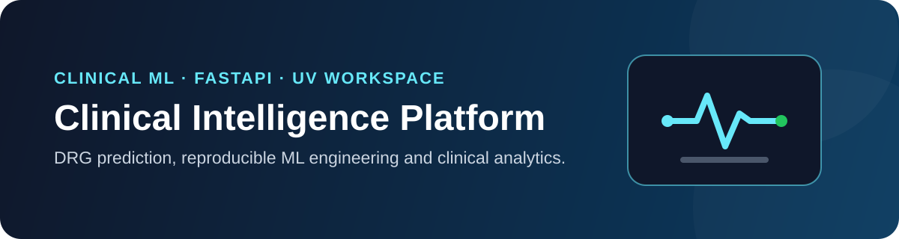

<p align="center">
  
</p>

<p align="center">
  <a href="https://github.com/JaimeArriagadaRosas/clinical-drg-predictor/actions/workflows/ci.yml"></a>
  
  
  
</p>

# Clinical Intelligence Platform

Plataforma modular de ingeniería de datos y Machine Learning clínico para predicción de **Grupos Relacionados por Diagnóstico (GRD)**, evolucionada desde un proyecto académico hacia una base reproducible de ML Engineering y analítica clínica.

El repositorio conserva la capacidad de clasificación GRD original, pero organiza el desarrollo nuevo mediante un **monorepo Python** y un **monolito modular** con límites explícitos entre transporte HTTP, contratos compartidos e inferencia.

## Capacidades actuales

- API HTTP oficial con FastAPI y OpenAPI.
- Inferencia GRD desacoplada del transporte HTTP.
- Contratos clínicos compartidos en paquetes reutilizables.
- Compatibilidad temporal con el pipeline y chatbot académicos existentes.
- Reutilización del esquema real de entrenamiento durante inferencia mediante `dataset/processed/metadata.pkl`.
- Pruebas automatizadas y CI sobre Python 3.11 y 3.12.
- Gestión reproducible del workspace con `uv`.

## Arquitectura del repositorio

```text
apps/
  api/                  FastAPI y composición HTTP
packages/
  clinical-core/        contratos clínicos compartidos
  clinical-drg/         dominio e inferencia GRD
dataset/                dataset fuente y artefactos locales generados
docs/                   documentación técnica viva
notebook/               análisis exploratorio histórico
src/                    compatibilidad temporal con el proyecto académico
tests/                  pruebas automatizadas del workspace
```

La arquitectura detallada y sus reglas de evolución están en [`docs/architecture.md`](docs/architecture.md).

## Requisitos

- Python 3.11 o 3.12
- [`uv`](https://docs.astral.sh/uv/)

## Inicio rápido

Instala el workspace y las herramientas de desarrollo:

```bash
uv sync --all-packages --group dev
```

Inicia la API oficial:

```bash
uv run uvicorn clinical_api.app:app --app-dir apps/api/src --reload
```

Comprueba liveness y disponibilidad del modelo:

```text
GET /health
```

Ejecuta una predicción GRD mediante:

```text
POST /v1/predictions/drg
```

La API puede iniciar sin un modelo entrenado. En ese estado `/health` informa que el modelo GRD no está disponible y el endpoint de predicción responde como servicio no preparado.

## Entrenamiento

Instala las dependencias del pipeline:

```bash
uv sync --all-packages --group dev --group training
```

Ejecuta el pipeline histórico mientras continúa su migración:

```bash
uv run --group training python src/training/training_main.py --skip-lgbm
```

Entre los artefactos generados localmente se encuentran:

```text
dataset/processed/metadata.pkl
models/best_model.pkl
```

`metadata.pkl` forma parte del contrato entre entrenamiento e inferencia porque conserva los códigos y el orden real de las features utilizadas por el modelo. Estos artefactos generados no deben versionarse.

## Compatibilidad histórica

El chatbot Flask/Gemini original permanece disponible únicamente como ruta de compatibilidad:

```bash
uv sync --all-packages --group training --group legacy-chatbot
uv run --group training --group legacy-chatbot python src/main.py
```

Las funcionalidades nuevas deben integrarse en `apps/api` y en los paquetes de dominio, no en la capa histórica de `src/`.

## Calidad y pruebas

Ejecuta las validaciones locales principales:

```bash
uv run ruff check apps packages tests
uv run pytest -q
```

La estrategia completa, incluyendo pruebas de API, dominio y contratos de entrenamiento, está documentada en [`docs/testing.md`](docs/testing.md).

## Contribución y seguridad

- Guía de contribución: [`.github/CONTRIBUTING.md`](.github/CONTRIBUTING.md)
- Política de seguridad: [`.github/SECURITY.md`](.github/SECURITY.md)
- Código de conducta: [`.github/CODE_OF_CONDUCT.md`](.github/CODE_OF_CONDUCT.md)

Nunca deben versionarse secretos, archivos `.env`, datos clínicos identificables, modelos generados ni datasets procesados locales.

## Licencia

Este repositorio se distribuye bajo la [MIT License](LICENSE).

## Aviso clínico

Este proyecto es de carácter académico y de ingeniería de software/ML. No constituye una herramienta de diagnóstico médico ni sustituye la evaluación de profesionales de la salud.
